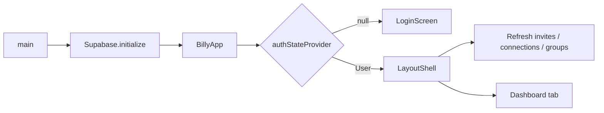
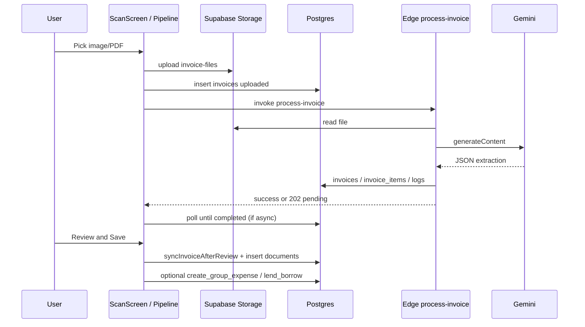
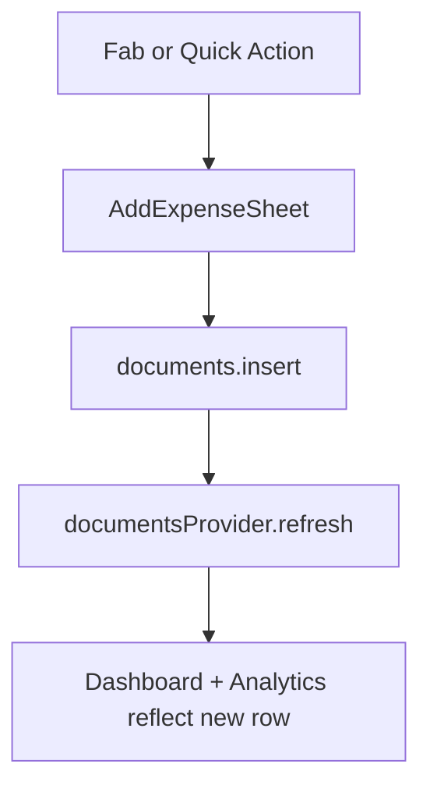

# Billy — Full application reference

This document describes what the **Billy** Flutter app does end-to-end: navigation, every major screen, user-visible flows, data written to Supabase, the invoice OCR pipeline, and how pieces connect. It reflects the codebase in this repository as of the time it was written.

---

## 1. Product summary

**Billy** is positioned as an “AI Financial OS”: a cross-platform (**iOS, Android, Web, desktop**) app for tracking **receipts and invoices**, optionally **splitting expenses in groups**, **recording money lent or borrowed** with contacts, and **exporting** activity to **PDF** or **CSV**. Document images and PDFs are processed with **Google Gemini** via a **Supabase Edge Function** (`process-invoice`), with structured results stored in Postgres and a simplified row in `documents` for dashboards and analytics.

**Stack**

| Layer | Technology |
|--------|------------|
| Client | Flutter 3.x, Material, `flutter_riverpod`, `go_router` is a dependency but **routing is primarily `MaterialApp` + `Navigator` + tab state** in `LayoutShell` |
| Backend | Supabase (Auth, Postgres, Storage, Edge Functions) |
| AI | Gemini (`gemini-2.5-flash-lite` in the Edge Function) |
| Export | `pdf` + `printing`, `csv`, `share_plus` |

**Configuration**

- Supabase URL and anon key: `lib/config/supabase_config.dart` (project may also document `.env`; the checked-in client uses the Dart constants).
- **Web note:** `main.dart` uses a custom `_NoKeepaliveFetchClient` for Safari compatibility with Supabase cross-origin requests.

---

## 2. App entry and authentication gate

### 2.1 `main.dart`

1. `WidgetsFlutterBinding.ensureInitialized()`
2. `Supabase.initialize(...)` with optional web-specific HTTP client
3. `runApp(ProviderScope(child: BillyApp()))`

### 2.2 `BillyApp` (`lib/app/app.dart`)

- Uses `MaterialApp` with `BillyTheme.lightTheme`, title **Billy**.
- Watches `authStateProvider` (Riverpod).
- **If user is non-null:** shows `LayoutShell` (main app).
- **If loading:** full-screen `CircularProgressIndicator`.
- **If error:** falls back to `LoginScreen` (same as logged-out).

### 2.3 `LoginScreen` (`lib/features/auth/screens/login_screen.dart`)

**What the user sees**

- Logo, title **Billy**, subtitle **AI Financial OS**
- Email and password fields
- Primary button: **Sign In** or **Sign Up** (toggle via “Create account” / “Already have an account?”)
- **Continue with Google** (OAuth via `signInWithOAuth(OAuthProvider.google)`)

**Behavior**

- **Sign up:** `auth.signUp` → message to check email for confirmation (if enabled in Supabase).
- **Sign in:** `auth.signInWithPassword`.
- Errors from `AuthException` show inline in a styled banner.

**Auth provider:** `lib/features/auth/providers/auth_provider.dart` — exposes `Stream<User?>` from `Supabase.instance.client.auth.onAuthStateChanges`.

---

## 3. Main shell: tabs, header, and global refresh

### 3.1 `LayoutShell` (`lib/app/layout_shell.dart`)

**Structure**

- `Scaffold` with `BillyTheme.scaffoldBg`
- **Top:** `BillyHeader` (fixed under `SafeArea`)
- **Body:** `AnimatedSwitcher` + `FadeTransition` between tab content
- **Bottom:** `BillyBottomNav`

**Tab indices**

| Index | Label (nav) | Screen widget |
|-------|-------------|----------------|
| 0 | Home | `DashboardScreen` |
| 1 | Analytics | `AnalyticsScreen` |
| 2 | Friends | `SplitScreen` (people, groups, lend/borrow — not “splits” table UI) |
| 3 | Settings | `SettingsScreen` |

**FAB (center, overlapping nav)**

- Green circular **+** button calls `_openAddExpense` → modal bottom sheet `AddExpenseSheet`.

**Post-frame initialization**

On first frame, the shell refreshes:

- `invitationsNotifierProvider`
- `connectionsNotifierProvider`
- `expenseGroupsNotifierProvider`

So invitations, contacts, and groups are loaded when the user lands in the app.

### 3.2 `BillyHeader` (`lib/app/widgets/billy_header.dart`)

- Left: app logo asset `assets/branding/billy_logo.png` (fallback: green tile with **B**)
- Text: **Welcome back!** / **Billy**
- Right: *(Customize pill removed — was a dead end.)*

### 3.3 `BillyBottomNav` (`lib/app/widgets/billy_bottom_nav.dart`)

- Four tabs: Home, Analytics, Friends, Settings
- Center **+** FAB triggers `onFabTap` (same as add expense)

---

## 4. Home (Dashboard)

**File:** `lib/features/dashboard/screens/dashboard_screen.dart`

**Data sources (Riverpod)**

- `weekSpendProvider`, `lastWeekSpendProvider` — calendar week vs previous week totals from `documents`
- `dailySpendProvider` — last **7 days** of spend (one query per day in `SupabaseService.dailySpendForWeek`)
- `recentDocsProvider` — up to 10 recent `documents`
- `documentsProvider` — full list for category rollups
- `profileProvider` — `preferred_currency` for formatting

**Widgets shown (top to bottom)**

1. **`SpendHero`** — week spend, comparison to last week, sparkline-style data from `dailySpendProvider`
2. **Row split:**
   - **`QuickActions`** — Create Bill, Link Bank, Export Data
   - **Column:** `MoneyFlowChart` (7-day bars), `InsightsCard` (total expenses + top categories from `description` first segment)
3. **`OcrBanner`** — CTA to open scan flow
4. **Recent** section (if any recent docs): heading **Recent** with **View all** → `DocumentsHistoryScreen`; `RecentActivity` list (5 items with `document_id`, tappable → `DocumentDetailScreen`): vendor, amount, category from description, relative date

**Callbacks from `LayoutShell`**

- **Scan:** pushes full-screen route with `AppBar` “Scan invoice” + `ScanScreen`
- **Export:** maps `documentsProvider` → `ExportDocument` list → pushes `ExportScreen`
- **Create bill:** `AddExpenseSheet` bottom sheet
- **All documents:** pushes `DocumentsHistoryScreen` (full list, search, filters, sort)

---

## 5. Quick actions detail

**`QuickActions`** (`lib/features/dashboard/widgets/quick_actions.dart`)

| Label | Action |
|--------|--------|
| Create Bill | Opens manual expense sheet |
| All documents | Opens `DocumentsHistoryScreen` |
| Export Data | Opens `ExportScreen` with all documents |

---

## 6. Manual expense entry (`AddExpenseSheet`)

**File:** `lib/features/dashboard/widgets/add_expense_sheet.dart`

**Fields**

- Toggle: **Receipt** / **Invoice**
- Vendor / company name
- Amount (label still shows `$` in one place; storage is numeric)
- Category dropdown: Food & Beverage, Dining, Groceries, Transportation, Shopping, Utilities, Maintenance, Equipment, Stationery, Other
- Date picker (defaults today)
- Optional notes

**Save**

- Calls `documentsProvider.notifier.addDocument` with `taxAmount: 0`, `description: _category` (category is stored in `description`, not `category_id`)
- Pops sheet on success

---

## 7. Scan and OCR pipeline (invoice / receipt)

### 7.1 Navigation

From the dashboard: **OCR banner** or scan entry → `Navigator.push` → `ScanScreen` inside a `Scaffold` with back button.

### 7.2 `ScanScreen` states (`lib/features/scanner/screens/scan_screen.dart`)

State machine: `idle` → `processing` → `success` | `error`

| State | UI widget |
|--------|-----------|
| `idle` | `ScanIdle` — camera, photo library, upload PDF/image |
| `processing` | `ScanProcessing` |
| `success` | `ScanReviewPanel` |
| `error` | `ScanError` — retry (discard) or back |

**Inputs**

- **Camera / gallery:** `image_picker`, max width 1920, quality 85, JPEG/PNG etc.
- **Files:** `file_picker` — `pdf`, `jpg`, `jpeg`, `png`, `webp`

**Pipeline call:** `InvoiceOcrPipeline.uploadAndProcess(...)` with `source`: `camera`, `gallery`, or `file`.

### 7.3 `InvoiceOcrPipeline` (`lib/features/invoices/services/invoice_ocr_pipeline.dart`)

**Steps**

1. Validate non-empty file, max **16 MB**
2. Require signed-in user
3. Generate UUID `invoiceId`
4. Build storage path: `{user_id}/{yyyy}/{mm}/{invoice_id}/{sanitizedFileName}`
5. **Upload** bytes to Storage bucket **`invoice-files`**
6. **Insert** row into **`invoices`** with `status: 'uploaded'`, `file_path`, `mime_type`, `source`
7. **Invoke** processing:
   - **Hosted web** (not localhost): `POST` to **`/api/process-invoice`** on same origin (Vercel proxy) with `Authorization: Bearer <access_token>` and `apikey: <anon>`
   - **Local / mobile / desktop:** `Supabase.functions.invoke('process-invoice', body: { invoice_id, file_path })`
8. Parse response:
   - If **202** or `pending: true`: **poll** `invoices` every 750ms until `status == completed` or `failed` (max ~180s)
   - Else synchronous success: build `ExtractedReceipt` from JSON `invoice` + `items`
9. On async completion: `_receiptFromDb` loads `invoices` + `invoice_items` and maps to `ExtractedReceipt`

**Errors**

- User-facing strings derived from `FunctionException`, HTTP status (401, 502, 503), and `processing_error` on failed rows

### 7.4 Edge Function `process-invoice` (summary)

**File:** `supabase/functions/process-invoice/index.ts`

- Downloads file from Storage, sends to **Gemini** (`gemini-2.5-flash-lite`) with a large structured JSON prompt (invoices, line items, Indian GST fields, FSSAI, etc.)
- Normalizes model output into invoice header + line items
- Writes to **`invoices`**, **`invoice_items`**, logging/timeline tables as implemented
- **API key resolution:** `profiles.gemini_api_key` for the JWT user, else environment **`GEMINI_API_KEY`** on the function

### 7.5 Review and save (`ScanReviewPanel`)

**File:** `lib/features/scanner/widgets/scan_review_panel.dart`

**User can edit**

- Vendor, date (`YYYY-MM-DD`), invoice number, category, notes
- Per–line item: include/exclude checkbox; when “group expense” is on, assign each included line to a **group member**

**Tax display**

- CGST, SGST, IGST, discount; total and “selected for split” amount (sum of included lines, or full total if no lines)

**Optional: Create group expense**

- Switch: “Create group expense from selection”
- Chooses group; can open `GroupExpensesScreen` for that group
- On save: builds **share map** from line assignees (or single assignee if no line items), then `SupabaseService.createGroupExpense` (RPC `create_group_expense`)

**Optional: Record lend / borrow**

- Switch + I lent / I borrowed + counterparty name + optional linked contact
- Amount used = **selected allocation total**
- Inserts via `lendBorrowProvider.addEntry`

**On Save (always, when valid)**

1. If `invoiceId` present: **`SupabaseService.syncInvoiceAfterReview`** — replaces `invoice_items`, updates `invoices` header, sets `status: confirmed`, `review_required: false`
2. **`documentsProvider.addDocument`** — one row in **`documents`** for the dashboard/analytics/export:
   - `type`: `invoice` if invoice number set, else `receipt`
   - `description`: comma-joined categories
   - `extracted_data`: JSON including line selection, assignees, allocation, `invoice_id`, and optional flags `intent_group_expense`, `group_id`, `intent_lend_borrow`, `lend_type`, `lend_counterparty` when those flows were enabled at save
3. Snackbar **Saved**, `onDone()` → scan route pops

---

## 8. Analytics tab

**File:** `lib/features/analytics/screens/analytics_screen.dart`

**Filters:** segmented control **1W** / **1M** / **3M** (`DocumentDateRange.forFilter`)

**Top-level segments (Material `SegmentedButton`):**

| Segment | Content |
|--------|---------|
| **Overview** | Same as before: charts and lists from in-memory `documents` (no server AI). |
| **AI Insights** | Cached snapshot from Postgres + **manual** “Refresh insights” only (no Gemini on tab switch). |

### 8.1 Overview (unchanged)

**Derived from in-memory `documents`** (filtered by date range):

- **Expense breakdown** card: donut (`fl_chart`) — top category share vs “rest”; total spend in center
- **Daily spend (7 days)** bar chart — `DocumentDateRange.lastSevenDaySpending` anchored to range **end** date
- **Top categories** list — top 4 categories with progress bars and emoji icons

**Category source:** first segment of `documents.description` split by `,`, same as dashboard insights.

### 8.2 AI Insights (document-backed, cost-controlled)

- **UI:** `lib/features/analytics/widgets/ai_insights_panel.dart`, state: `lib/features/analytics/providers/analytics_insights_provider.dart`
- **On entering AI Insights:** loads last row from `analytics_insight_snapshots` for the current preset (`SupabaseService.fetchAnalyticsInsightSnapshot`) — **read only**, no Edge invoke.
- **Refresh insights:** single POST to Edge Function `analytics-insights` (or hosted web: `POST /api/analytics-insights`). That request recomputes **deterministic** rollups in Postgres (via user-scoped queries) and, when `include_ai: true`, makes **at most one** Gemini call for `short_narrative` + `prioritized_insights`. Result is **upserted** into `analytics_insight_snapshots`.
- **Drill-down:** insight rows open `DocumentsHistoryScreen` with `restrictToDocumentIds` for evidence.
- **Document detail:** **Analyze this document** → `DocumentAiReviewScreen` loads facts via `fetchDocumentById` only; **Run AI review** is a separate explicit action calling the same Edge function with `document_id` + `include_ai: true`.

**Backend:** `supabase/functions/analytics-insights/index.ts`, migration `20260404100000_analytics_insight_snapshots.sql`, Vercel proxy `web/api/analytics-insights.js`.

**Gemini key:** same resolution as `process-invoice` — `profiles.gemini_api_key` then `GEMINI_API_KEY` secret.

---

## 9. Friends tab (`SplitScreen`) — contacts, groups, lend/borrow

**File:** `lib/features/lend_borrow/screens/split_screen.dart`

Despite the filename, this is the **People & groups** hub (bottom nav **Friends**).

### 9.1 Invitations

- Email field + **Invite** → RPC `invite_contact_by_email`
- **Incoming** invitations: accept / reject (`accept_contact_invitation`, `reject_contact_invitation`)
- **Outgoing:** cancel (`cancelOutgoingInvitation`)
- On app open, `sync_invitation_recipient` links pending invites to the logged-in user by email

### 9.2 Contacts

- Loaded via `user_connections` + profile display names; shown as chips

### 9.3 Groups

- **New** → dialog for name → `createExpenseGroup` + optional member picker (from connections)
- List tiles: member count, tap → **`GroupExpensesScreen`**
- **Add member** icon on a group → pick connections to `addUserToExpenseGroup`

### 9.4 Lend / borrow ledger

- Summary cards: **To collect** / **To pay back** (from pending entries, perspective-adjusted via `effectiveTypeForViewer` in `lend_borrow_perspective.dart`)
- Tabs: filter list to **lent** vs **borrowed** from viewer’s perspective
- Search by counterparty display name
- **Add transaction** sheet: I lent / I borrowed, optional linked contact, optional group, name, amount → `lendBorrowProvider.addEntry`
- Per-row **settle** → `settleLendBorrow` (`status: settled`)

---

## 10. Group expenses and settlements

**File:** `lib/features/groups/screens/group_expenses_screen.dart`

**Shows**

- Group name, member list context
- **Add expense** (equal split helper `_equalShares` across selected members or all)
- List of **`group_expenses`** with payer and participant shares
- **Balances** via `group_balance.dart` / ledger logic
- **Record payment** bottom sheet → `insertGroupSettlement` (you paid another member); invalidates expenses + settlements providers

**Backend:** `create_group_expense` RPC ensures atomic insert of expense + participant shares.

---

## 11. Settings and profile

### 11.1 `SettingsScreen` (`lib/features/settings/screens/settings_screen.dart`)

- **Display currency** dropdown: USD, EUR, GBP, INR, JPY, CAD, AUD → updates `profiles.preferred_currency` (formatting only; **no currency conversion** of stored amounts)
- **Account** tile → `ProfileScreen`
- **Export data** tile → `ExportScreen` with current documents

### 11.2 `ProfileScreen` (`lib/features/profile/screens/profile_screen.dart`)

- Avatar initial, display name from `userMetadata` or email
- Stats: **RECEIPTS** count, **TOTAL SPEND** (rough display with `$` and `k` suffix — not wired to `preferred_currency` for that stat label)
- Tiles: Notifications, Export Data, Privacy Policy — **no-op** except Export
- **Log out** → `auth.signOut()`

**Note:** `profiles.gemini_api_key` exists in the schema and is used by the Edge Function; there is **no settings UI** in the reviewed screens for editing that key (could be added via `SupabaseService.updateProfile`).

---

## 12. Export

**File:** `lib/features/export/screens/export_screen.dart`

- Date range pickers (defaults: last 30 days to today)
- Format: **PDF** or **CSV**
- **PDF:** `PdfGenerator.generateReport` → `Printing.sharePdf`
- **CSV:** `CsvGenerator.generate` → `Share.shareXFiles`

**Input model:** `ExportDocument` (vendor, amount, date, category, type) — built from `documents` rows when opening from dashboard, settings, or profile.

**Note:** The **`export_history`** table exists in migrations but the export flow **does not** write audit rows to it in the current client code.

---

## 13. Data layer (`SupabaseService`)

**File:** `lib/services/supabase_service.dart`

| Area | Key methods / behavior |
|------|-------------------------|
| Documents | `fetchDocuments`, `insertDocument`, `deleteDocument` |
| Invoices OCR follow-up | `syncInvoiceAfterReview` |
| Lend/borrow | `fetchLendBorrow`, `insertLendBorrow`, `settleLendBorrow`, `deleteLendBorrow` |
| Splits (legacy schema) | `fetchSplits`, `insertSplit` — **not used by current UI** |
| Profile | `fetchProfile`, `updateProfile`, `getGeminiApiKey` |
| Social | RPCs + `contact_invitations`, `user_connections` |
| Groups | `fetchExpenseGroups`, `createExpenseGroup`, `addUserToExpenseGroup`, `fetchGroupExpenses`, `createGroupExpense`, `deleteGroupExpense`, `fetchGroupSettlements`, `insertGroupSettlement`, `deleteGroupSettlement` |
| Connected apps | `fetchConnectedApps` — **no UI reference** in `lib/` |
| Aggregations | `todaySpend`, `weekSpend`, `recentDocuments`, `categoryBreakdown`, `dailySpendForWeek` |

---

## 14. Riverpod providers (high level)

| Provider | Role |
|----------|------|
| `authStateProvider` | Auth session user |
| `documentsProvider` | List of documents + add/delete/refresh |
| `todaySpendProvider`, `weekSpendProvider`, `lastWeekSpendProvider`, `recentDocsProvider`, `dailySpendProvider` | Dashboard stats |
| `profileProvider` | Current user profile row |
| `lendBorrowProvider` | Lend/borrow entries |
| `invitationsNotifierProvider` | Contact invitations |
| `connectionsNotifierProvider` | Mutual connections with display names |
| `expenseGroupsNotifierProvider` | Expense groups + members |
| `groupExpensesProvider(groupId)` | Group ledger |
| `groupSettlementsProvider(groupId)` | Settlements for group |
| `splitsProvider` | Defined in `splits_provider.dart` — **not wired into `LayoutShell` or main tabs** |

---

## 15. Database schema (Postgres) — conceptual map

Migrations live under `supabase/migrations/`.

**Core**

- **`profiles`** — extends `auth.users`; `display_name`, `avatar_url`, `preferred_currency`, `gemini_api_key`, timestamps
- **`categories`** — user/default categories (**app currently stores category text on `documents.description` for manual entry**)
- **`documents`** — main user-facing ledger: `type` invoice/receipt, `vendor_name`, `amount`, `currency`, `tax_amount`, `date`, `description`, `payment_method`, `status`, `extracted_data` JSON
- **`lend_borrow_entries`** — `counterparty_name`, `amount`, `type` lent/borrowed, `status`, optional `counterparty_user_id`, `group_id`
- **`splits` / `split_participants`** — bill-split schema (**no main UI**)
- **`connected_apps`**, **`export_history`** — present; **limited or no client usage**

**Social & groups** (`20240401000000_contacts_groups_shared_lend.sql`)

- **`contact_invitations`**, **`user_connections`**
- **`expense_groups`**, **`expense_group_members`**
- RLS updates for shared visibility on lend/borrow

**Group expenses & settlements**

- **`group_expenses`**, **`group_expense_participants`**, RPC **`create_group_expense`**
- **`group_settlements`**

**Invoice OCR** (`20260401120000_invoice_ocr_pipeline.sql`)

- **`invoices`**, **`invoice_items`**, **`invoice_ocr_logs`**, **`invoice_processing_events`**
- Storage bucket **`invoice-files`** (private, MIME allowlist, 16 MB)

**RLS**

- Baseline: `20240318000001_rls_policies.sql` (user-scoped `documents`, etc.)
- Later migrations replace/extend policies for invitations, groups, shared lend/borrow, invoice tables

---

## 16. End-to-end flow diagrams

### 16.1 Cold start → home

### 16.2 Scan → document saved

### 16.3 Manual expense

---

## 16b. Documents history, detail, and edit (post-save)

| Screen | File | Purpose |
|--------|------|---------|
| All documents | `lib/features/documents/screens/documents_history_screen.dart` | List from `documentsProvider`, search by vendor, filters (All / Receipts / Invoices / Manual / OCR), sort, pull-to-refresh |
| Document detail | `lib/features/documents/screens/document_detail_screen.dart` | Full header + tax + line items from `extracted_data`, linked-scan “Open original file” via signed Storage URL when `invoice_id` exists, edit/delete |
| Document edit | `lib/features/documents/screens/document_edit_screen.dart` | Updates `documents` via `SupabaseService.updateDocument`; if `invoice_id` in `extracted_data`, also **`syncInvoiceAfterReview`** |

Service additions: `fetchDocumentById`, `updateDocument`, `signedUrlForInvoiceFile`, `fetchInvoiceHeaderForUser`; `deleteDocument` scoped with `user_id`.

---

## 17. UI placeholders and limitations (explicit)

| Surface | Behavior |
|---------|----------|
| BillyHeader “Customize” | Removed (was dead end) |
| Analytics notification/settings icons | Removed (were dead ends) |
| Quick action “Link bank” | Replaced by **All documents** |
| Profile Notifications / Privacy | Empty handlers |
| `documents.category_id` | Not set by current manual or OCR save path (category in `description` / JSON) |
| `export_history` | Not written on export |
| `splits` feature table | Provider exists; no tab or screen |
| `connected_apps` | Service method only |
| `go_router` | Dependency present; app uses `Navigator` + tab index |

---

## 18. File map (where to look)

| Concern | Location |
|---------|----------|
| Theme | `lib/core/theme/billy_theme.dart` |
| Currency formatting | `lib/core/formatting/app_currency.dart` |
| Logging | `lib/core/logging/billy_logger.dart` |
| App root | `lib/app/app.dart`, `lib/app/layout_shell.dart` |
| Auth UI | `lib/features/auth/screens/login_screen.dart` |
| Dashboard widgets | `lib/features/dashboard/widgets/` |
| Scanner | `lib/features/scanner/` |
| Documents history / detail / edit | `lib/features/documents/` |
| OCR pipeline client | `lib/features/invoices/services/invoice_ocr_pipeline.dart` |
| Edge Function | `supabase/functions/process-invoice/index.ts` |
| Migrations | `supabase/migrations/*.sql` |

---

## 19. Related docs in repo

- **`AGENTS.md`** — suggested agent roles for future work
- **`.cursor/rules/billy-conventions.mdc`** — structure and stack conventions

---

*This reference is generated from the implementation; if the code changes, update this document or regenerate it to stay aligned.*
